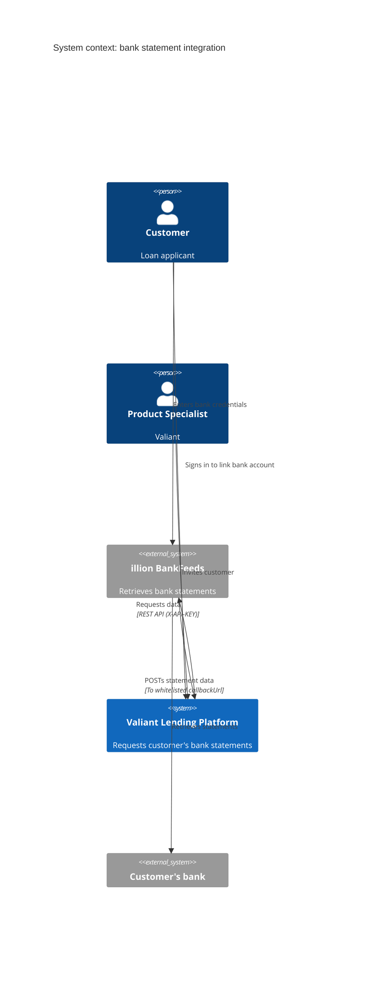
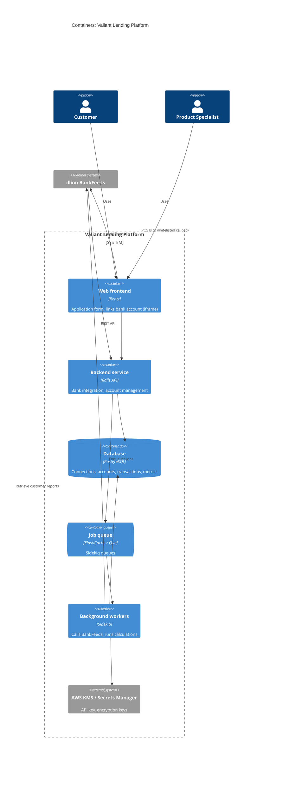
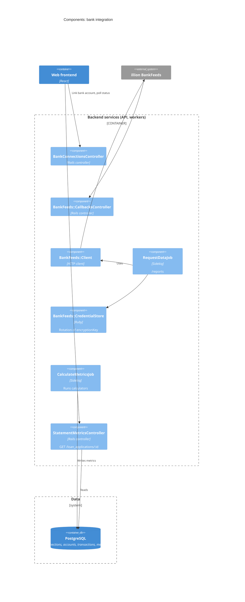
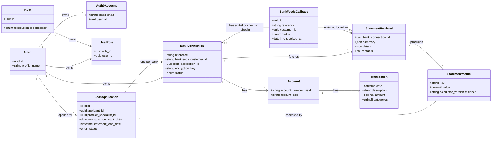
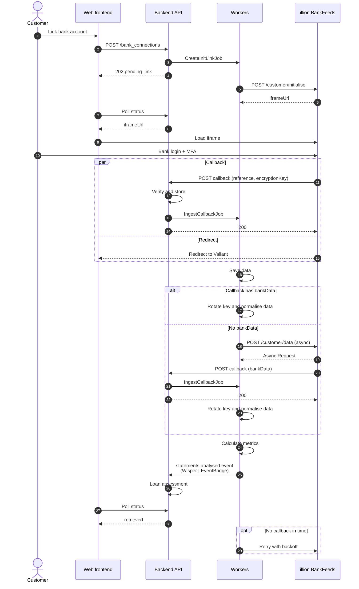

## C4 + sequence diagrams (WIP)

### Context

```mermaid
---
config:
  c4:
    c4ShapeMargin: 90
---
C4Context
  title System context: bank statement integration

  Person(customer, "Customer", "Loan applicant")
  Person(specialist, "Product Specialist", "Valiant")
  System_Ext(bankfeeds, "illion BankFeeds", "Retrieves bank statements")
  System(valiant, "Valiant Lending Platform", "Requests customer's bank statements")
  System_Ext(bank, "Customer's bank")

  Rel_D(customer, bankfeeds, "Enters bank credentials")
  Rel(customer, valiant, "Signs in to link bank account")
  Rel_D(specialist, valiant, "Invites customer")
  Rel_R(valiant, bankfeeds, "Requests data", "REST API (X-API-KEY)")
  Rel_L(bankfeeds, valiant, "POSTs statement data", "To whitelisted callbackUrl")
  Rel_D(bankfeeds, bank, "Retrieves statements")

  UpdateRelStyle(customer, valiant, $offsetX="10", $offsetY="-30")
  UpdateRelStyle(valiant, bankfeeds, $offsetX="-90", $offsetY="-80")
  UpdateRelStyle(bankfeeds, valiant, $offsetX="-75", $offsetY="55")
  UpdateLayoutConfig($c4ShapeInRow="2", $c4BoundaryInRow="1")
```

### Containers

```mermaid
---
config:
  c4:
    c4ShapeMargin: 80
---
C4Container
  title Containers: Valiant Lending Platform

  Person(customer, "Customer")
  Person(specialist, "Product Specialist")
  System_Ext(bankfeeds, "illion BankFeeds")

  System_Boundary(valiant, "Valiant Lending Platform") {
    Container(spa, "Web frontend", "React", "Application form, links bank account (iframe)")
    Container(api, "Backend service", "Rails API", "Bank integration, account management")
    ContainerDb(db, "Database", "PostgreSQL", "Connections, accounts, transactions, metrics")
    ContainerQueue(queue, "Job queue", "ElastiCache / Que", "Sidekiq queues")
    Container(workers, "Background workers", "Sidekiq", "Calls BankFeeds, runs calculations")
    System_Ext(kms, "AWS KMS / Secrets Manager", "API key, encryption keys")
  }

  Rel_D(customer, spa, "Uses")
  Rel(specialist, spa, "Uses")
  Rel(spa, bankfeeds, "Loads iframe")
  Rel_D(bankfeeds, api, "POSTs to whitelisted callback")
  Rel_R(spa, api, "REST API")
  Rel(api, db, "")
  Rel_D(api, queue, "Enqueues jobs")
  Rel_D(queue, workers, "")
  Rel(workers, db, "")
  Rel_R(workers, kms, "")
  Rel(workers, bankfeeds, "Retrieve customer reports")

  UpdateRelStyle(spa, api, $offsetX="-70", $offsetY="-45")
  UpdateRelStyle(workers, bankfeeds, $offsetX="-270", $offsetY="300")
  UpdateRelStyle(bankfeeds, api, $offsetX="140", $offsetY="-150")
  UpdateRelStyle(workers, kms, $offsetX="-70", $offsetY="20")
  UpdateLayoutConfig($c4ShapeInRow="3", $c4BoundaryInRow="1")
```

### Components

```mermaid
---
config:
  c4:
    c4ShapeMargin: 70
---
C4Component
  title Components: bank integration

  Container(spa, "Web frontend", "React")
  System_Ext(bankfeeds, "illion BankFeeds")

  Container_Boundary(app, "Backend services (API, workers)") {
    Component(connCtrl, "BankConnectionsController", "Rails controller",)
    Component(cbCtrl, "BankFeeds::CallbacksController", "Rails controller")
    Component(client, "BankFeeds::Client", "HTTP client")
    Component(requestJob, "RequestDataJob", "Sidekiq", "/reports")
    Component(keyStore, "BankFeeds::CredentialStore", "Ruby", "Rotation of encryptionKey")
    Component(calcJob, "CalculateMetricsJob", "Sidekiq", "Runs calculators")
    Component(metricsCtrl, "StatementMetricsController", "Rails controller", "GET /loan_applications/:id")
  }

  Boundary(stores, "Data") {
    ContainerDb(db, "PostgreSQL", "Connections, accounts, transactions, metrics")
  }

  Rel_D(spa, connCtrl, "Link bank account, poll status")
  Rel(spa, metricsCtrl, "")
  Rel_D(bankfeeds, cbCtrl, "")
  Rel_U(client, bankfeeds, "")
  Rel_U(requestJob, client, "Uses")
  Rel(requestJob, keyStore, "")

  Rel_D(calcJob, db, "Writes metrics")
  Rel(metricsCtrl, db, "Reads")

  UpdateRelStyle(spa, connCtrl, $offsetX="-10", $offsetY="-100")
  UpdateLayoutConfig($c4ShapeInRow="3", $c4BoundaryInRow="1")
```

### Classes

```mermaid
classDiagram
  direction LR

  class User {
    +uuid id
    +string profile_name
  }

  class Auth0Account {
    +string email_sha2
    +uuid user_id
  }

  class UserRole {
    +uuid role_id
    +uuid user_id
  }

  class Role {
    +uuid id
    +enum role  (customer | specialist)
  }

  class LoanApplication {
    +uuid id
    +uuid applicant_id
    +uuid product_specialist_id
    +datetime statement_start_date
    +datetime statement_end_date
    +enum status
  }

  class BankConnection {
    +string reference
    +string bankfeeds_customer_id
    +uuid loan_application_id
    +string encryption_key
    +enum status
  }

  class StatementRetrieval {
    +uuid bank_connection_id
    +json summary
    +json details
    +enum status
  }

  class BankFeedsCallback {
    +uuid id
    +string reference
    +uuid customer_id
    +enum status
    +datetime received_at
  }

  class Account {
    +string account_number_last4
    +string account_type
  }

  class Transaction {
    +datetime date
    +string description
    +decimal amount
    +string[] categories
  }

  class StatementMetric {
    +string key
    +decimal value
    +string calculator_version # pinned
  }

  User "1" --> "1" Auth0Account : owns
  User "1" --> "*" UserRole : owns
  Role "1" --> "*" UserRole : owns
  User "1" --> "*" LoanApplication : applies for
  User "1" --> "*" BankConnection : owns
  LoanApplication "1" --> "*" BankConnection : one per bank
  LoanApplication "1" --> "*" StatementMetric : assessed by
  BankConnection "1" --> "*" StatementRetrieval : fetches
  BankConnection "1" --> "*" Account : has
  BankConnection "0..1" <-- "*" BankFeedsCallback : has (initial connection, refresh)
  BankFeedsCallback "*" --> "0..1" StatementRetrieval : matched by token
  StatementRetrieval "1" --> "*" StatementMetric : produces
  Account "1" --> "*" Transaction : has
```

### Sequence

```mermaid
sequenceDiagram
  autonumber
  actor C as Customer
  participant FE as Web frontend
  participant API as Backend API
  participant W as Workers
  participant IL as illion BankFeeds

  C->>FE: Link bank account
  FE->>API: POST /bank_connections
  API->>W: CreateInitLinkJob
  API-->>FE: 202 pending_link
  W->>IL: POST /customer/initialise
  IL-->>W: iframeUrl
  FE->>API: Poll status
  API-->>FE: iframeUrl

  FE->>IL: Load iframe
  C->>IL: Bank login + MFA

  par Callback
    IL->>API: POST callback (reference, encryptionKey)
    API->>API: Verify and store
    API->>W: IngestCallbackJob
    API-->>IL: 200
  and Redirect
    IL-->>FE: Redirect to Valiant
  end

  W->>W: Save data

  alt Callback has bankData
    W->>W: Rotate key and normalise data
  else No bankData
    W->>IL: POST /customer/data (async)
    IL-->>W: Async Request
    IL->>API: POST callback (bankData)
    API->>W: IngestCallbackJob
    API-->>IL: 200
    W->>W: Rotate key and normalise data
  end

  W->>W: Calculate metrics
  W->>API: statements.analysed event <br>(Wisper | EventBridge)
  API->>API: Loan assessment
  FE->>API: Poll status
  API-->>FE: retrieved

  opt No callback in time
    W->>IL: Retry with backoff
  end
```
